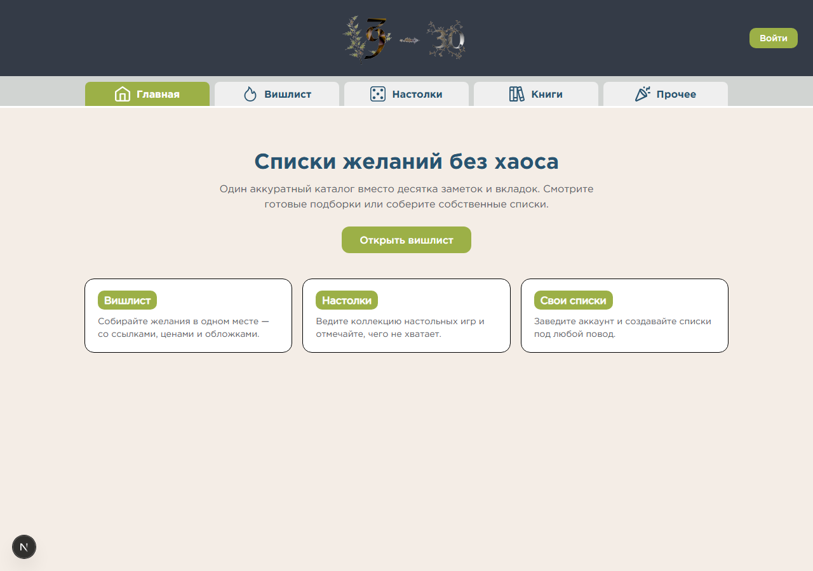
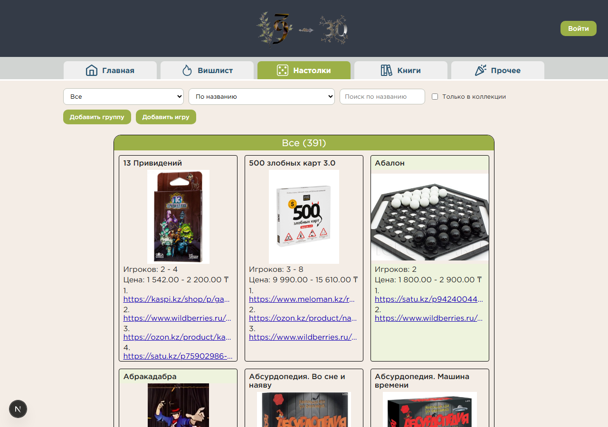
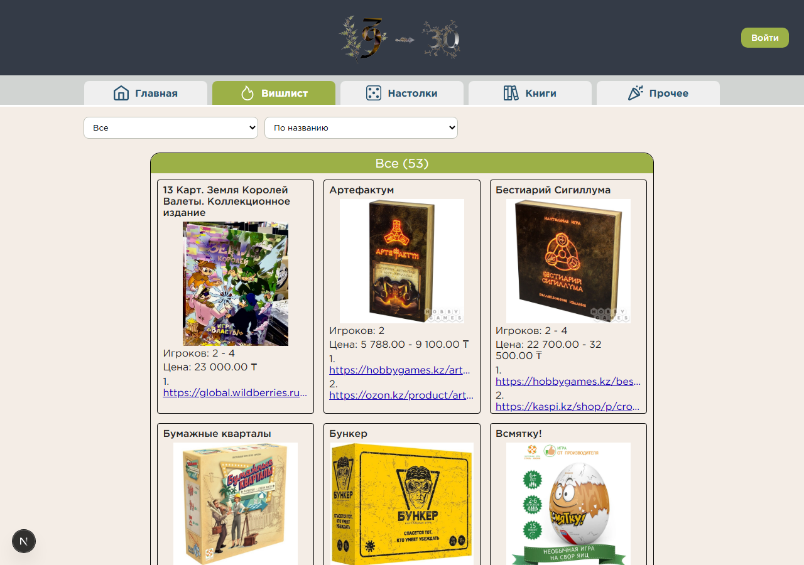
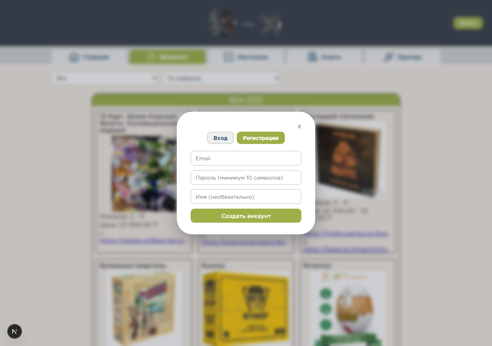
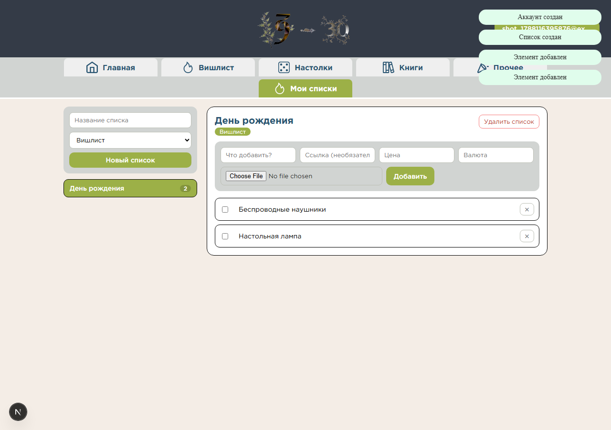

# WishList

Приложение для личных списков желаний и каталога настольных игр.

## Возможности

- регистрация и авторизация;
- личные списки и элементы с ценой, ссылкой и обложкой;
- отметка выполненных желаний;
- каталог настольных игр;
- поиск, фильтрация и сортировка;
- загрузка обложек и PDF-инструкций.

## Интерфейс

| | |
| --- | --- |
|  |  |
|  |  |
|  | |

## Стек

- Next.js 16, React 19, CSS Modules;
- Express 5, TypeScript, PostgreSQL;
- Vitest, Testing Library, Supertest, Playwright;
- Docker Compose.

## Структура

```text
apps/backend     API, миграции и seed
apps/frontend    интерфейс
packages/shared  общие типы и маршруты API
docker           Dockerfile и entrypoint
```

## Запуск

Требуются Node.js 24, npm 11 и PostgreSQL.

```bash
cp .env.example .env
npm ci
npm run migrate
npm run dev
```

- Frontend: http://localhost:3000
- API: http://localhost:3031
- Healthcheck: http://localhost:3031/health

### Docker

```bash
cp .env.example .env
npm run docker:up
```

```bash
npm run docker:down
npm run docker:reset
```

## Конфигурация

Переменные перечислены в `.env.example`.

| Переменная | Назначение |
| --- | --- |
| `DATABASE_URL` | подключение к PostgreSQL |
| `CORS_ORIGINS` | разрешённые origin |
| `JWT_ACCESS_SECRET` | ключ access-токенов |
| `JWT_REFRESH_SECRET` | ключ refresh-токенов |
| `UPLOAD_DIR` | каталог обложек и инструкций |
| `NEXT_PUBLIC_API_BASE_URL` | адрес API для frontend |

## Команды

```bash
npm run lint
npm run typecheck
npm run test
npm run build
npm run e2e
npm run migrate
npm run seed
```

## API

| Метод | Путь |
| --- | --- |
| `POST` | `/auth/register` |
| `POST` | `/auth/login` |
| `POST` | `/auth/refresh` |
| `POST` | `/auth/logout` |
| `GET` | `/auth/me` |
| `GET`, `POST` | `/lists` |
| `GET`, `PATCH`, `DELETE` | `/lists/:id` |
| `GET`, `POST` | `/lists/:id/items` |
| `PATCH`, `DELETE` | `/lists/:id/items/:itemId` |
| `GET` | `/catalog/sections` |
| `GET` | `/catalog/wish-types` |
| `GET`, `POST` | `/catalog/groups` |
| `GET`, `POST` | `/catalog/games` |
| `POST` | `/uploads` |
| `GET` | `/files/:id` |
